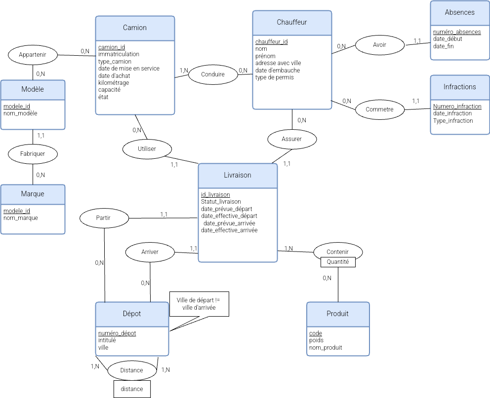

# Projet SGBD - Gestion d'une flotte de véhicules logistiques

## Description

Ce projet consiste à concevoir une base de données pour la gestion d'une flotte de camions dans une entreprise de transport de marchandises. L'objectif est de mettre en œuvre des notions de SGBD telles que la modélisation des données, la création d'une base de données relationnelle, ainsi que la mise en œuvre de diverses opérations (consultations, mises à jour, etc.).

L'application permet de consulter des informations sur les camions, les chauffeurs, les dépôts, et les livraisons, ainsi que d'effectuer des statistiques et des mises à jour sur la base de données.

## Schéma Entité-Association

### Modèle Conceptuel de Données (MCD)

Voici le diagramme de modélisation des données (Entité-Association) du projet.

  

> **Note :** Ce schéma représente les principales entités (camions, chauffeurs, dépôts, produits, livraisons) ainsi que leurs associations (par exemple, un chauffeur peut conduire plusieurs camions, un camion peut transporter plusieurs produits, etc.).

## Modèle Relationnel

### Tables

Le modèle relationnel du projet repose sur les tables suivantes :

1. **Camion**
   - `immatriculation` (PK)
   - `marque`
   - `type`
   - `modele`
   - `date_mise_en_service`
   - `date_achat`
   - `kilometrage`
   - `capacite`
   - `etat`

2. **Chauffeur**
   - `id_chauffeur` (PK)
   - `nom`
   - `prenom`
   - `adresse`
   - `ville`
   - `anciennete`
   - `type_permis`
   - `note_performance`

3. **Depot**
   - `id_depot` (PK)
   - `numero`
   - `intitule`
   - `ville`

4. **Produit**
   - `produit_id` (PK)
   - `nom_produit`
   - `poids`

5. **Livraison**
   - `id_livraison` (PK)
   - `date_livraison`
   - `id_camion` (FK)
   - `id_chauffeur` (FK)
   - `id_depot_depart` (FK)
   - `id_depot_arrivee` (FK)

6. **Produit_Livraison** (Table d'association entre Livraison et Produit)
   - `id_livraison` (FK)
   - `produit_id` (FK)

### Contraintes d'Intégrité

- Clés primaires et étrangères pour garantir l'intégrité référentielle.
- Contraintes de vérification sur des colonnes telles que le kilométrage, la capacité et l'état des camions.
- Indices de performance pour optimiser les requêtes sur les camions et chauffeurs.

### Schéma Relationnel en 3e Forme Normale

Toutes les tables ont été mises en 3NF pour assurer l'absence de redondances et garantir une bonne organisation des données.

## Installation et Utilisation

### Prérequis

- **Node.js** : Version >= 14
- **SGBD** : MySQL, PostgreSQL (ou tout autre système relationnel compatible SQL)
- **Framework** : Utilisation de Node.js avec une architecture simple pour l'interface.

### Instructions d'Installation

1. **Cloner le dépôt**
   
   Clonez ce projet sur votre machine locale avec la commande suivante :
   ```bash
   git clone https://github.com/nom-du-projet.git
   cd nom-du-projet
2. **Installer les dependances**

3. **Configurer la base de données**

    Assurez-vous d'avoir un serveur de base de données MySQL ou PostgreSQL en fonctionnement.
    Créez une base de données vide, puis exécutez les scripts de création pour configurer la base.
    Pour MySQL, connectez-vous à votre base et exécutez :
    ```sql
    SOURCE path/to/your/sql/create.sql;
   
## Requêtes SQL

Les scripts suivants sont inclus pour manipuler la base de données :

#### 1. `create.sql`
Crée la base de données et ses tables.

#### 2. `insert.sql`
Insère des données d'exemple dans la base de données.

#### 3. `select.sql`
Contient des exemples de requêtes de consultation.

#### 4. `update.sql`
Contient des exemples de requêtes de mise à jour.

#### 5. `drop.sql`
Supprime la base de données.